# Exercise 1: Introduction to Retrieval-Augmented Generation (RAG) Automation and Copilot Studio 

### Estimated Duration: 30 Minutes

## Overview

This exercise introduces the foundational concepts and practical applications of Retrieval-Augmented Generation (RAG) and the capabilities of Copilot Studio in automating intelligent workflows. By combining AI-driven generative models with external knowledge retrieval, participants will learn how to build scalable and dynamic RAG solutions tailored for real-world challenges.

## Objectives

You will be able to complete the following tasks:

- Task 1 : Overview of RAG and Automation

- Task 2 : Setting Up an Environment for Copilot Studio

### Task 1: Overview of RAG and Automation

In this task, you will explore the fundamentals of Retrieval-Augmented Generation (RAG) and its role in creating intelligent, context-aware AI solutions. you'll also set up Copilot Studio.

#### Introduction to Retrieval-Augmented Generation (RAG)

Retrieval-Augmented Generation (RAG) is a powerful approach in AI that combines retrieval techniques with generative models to deliver accurate and contextually rich responses. By integrating external knowledge sources, RAG enables the generation of more informed outputs compared to standalone generative models. Key features of RAG include:

- **Enhanced Contextual Understanding:** Incorporating relevant documents, databases, or files during inference.

- **Dynamic Knowledge Updates:** Ensuring outputs stay accurate and up-to-date without retraining models.

- **Scalability:** Seamlessly handling diverse data sources and scaling to enterprise needs.

#### Role of Copilot Studio in Automating RAG Workflows

Copilot Studio streamlines the process of building and automating RAG solutions by offering an intuitive interface for integrating AI capabilities. Key benefits include:

- **Workflow Automation:** Orchestrate end-to-end RAG processes, from data ingestion to output generation.

- **Custom Skills:** Enhance workflows by integrating bespoke logic or domain-specific expertise.

- **Data Management:** Simplify handling diverse input formats like text, Excel, slides, and images.

- **Model Flexibility:** Leverage advanced models such as GPT, embedding models, or hybrid retrieval techniques.

#### Real-World Use Cases

To understand the versatility of RAG, let’s explore some key use cases across different industries:

- **Customer Support:** RAG enhances customer service by providing accurate and context-specific responses. For instance, an AI assistant can use RAG to retrieve information from FAQs, user manuals, or internal knowledge bases to resolve customer queries quickly and efficiently, improving response quality and customer satisfaction.

- **Healthcare:** In healthcare, RAG assists in diagnosing complex cases by retrieving the latest medical research, case studies, and drug information. This ensures that doctors have access to up-to-date, relevant information, enabling better patient outcomes and supporting decisions in critical scenarios.

- **Financial Services:** RAG is helpful in financial services, where it supports wealth managers and advisors by providing personalized investment insights. It retrieves market trends, stock data, and regulatory updates, tailoring advice to individual client profiles. Additionally, it automates the generation of financial reports, streamlining processes and ensuring accuracy.

- Study Partner: RAG can be used to enhance the learning experience for study partners by retrieving relevant study materials, practice questions, and academic resources from textbooks, research papers, or online databases. It can help study groups by providing instant answers to questions, summarizing complex topics, or offering additional resources, improving collaboration and efficiency in preparing for exams or assignments.

For this lab, you will focus on the Study Partner use case, where we crafted the dataset with intresting physics topics that you can explore.

### Task 2: Setting Up an Environment for Copilot Studio

In this task, you will create a environment in powerplatform to use with copilot studio and log in to Copilot Studio to access the environmnet created.

1. From your browser, navigate to **Power Platform Admin Center** using this link [Power Platform](https://admin.powerplatform.microsoft.com/)

1. In the **Sign in** page, use provided credentials and sign in to power platform and click on **Next**.

   - Email/Username: <inject key="AzureAdUserEmail"></inject>

     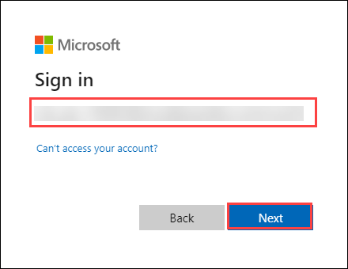

1. Now, enter the following password and click on **Sign in**.

   - Password: <inject key="AzureAdUserPassword"></inject>

     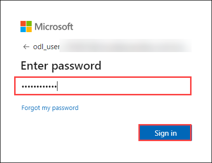
   
1. On the **Stay signed in** pane, click on **No**.

   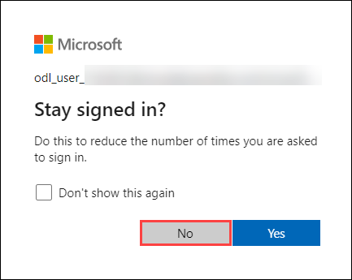

1. Once signed in, toggle **Try the new admin center** button to use new experiance.

   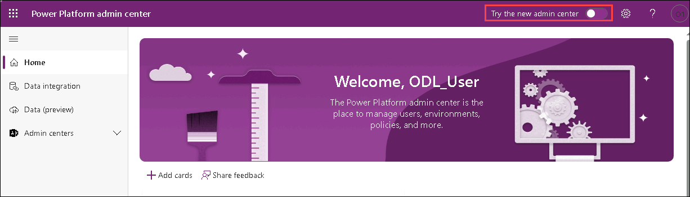

1. Once you are in the **Power Platform Admin center** page, select **Manage (1)** from left menu and click on **+ New (2)**, to create a new environment.

   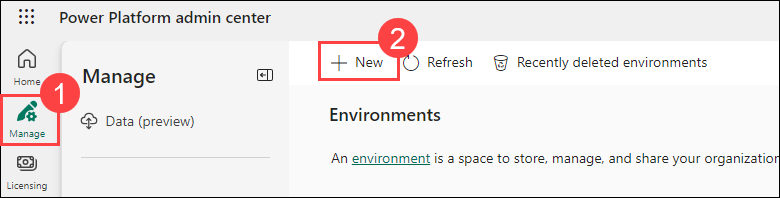

1. In the **New environment** page, provide the following details and click on **Next (5)** :

   - **Name**: provide as **odl_user_<inject key="DeploymentID" enableCopy="false" />_env** **(1)**.

   - **Get new features early**: Toggle this option to **Yes (2)**.

   - **Type**: Select **Production (3)** from dropdown.

   - **Add a Dataverse data store**: Toggle this option to **Yes (4)**.

     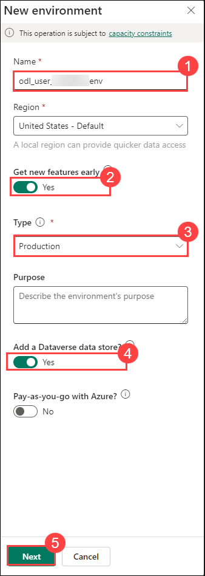

1. In the next pane, click on **+ Select** under **Security group**.

   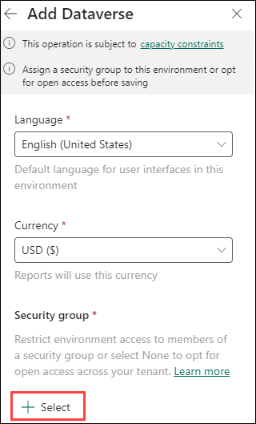

1. In the **Edit security group** pane, choose **None** option and click on **Done**.

   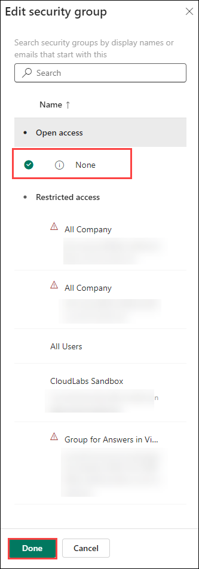

1. Once configurations are done, click on **Save**.

   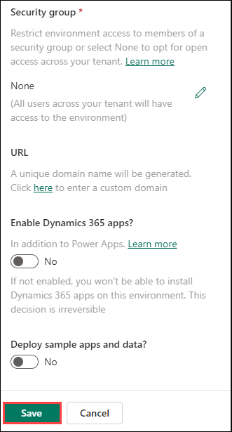

1. Now the environment creation will start, please wait till the **State** changes from **Preparing** to **Ready**.

   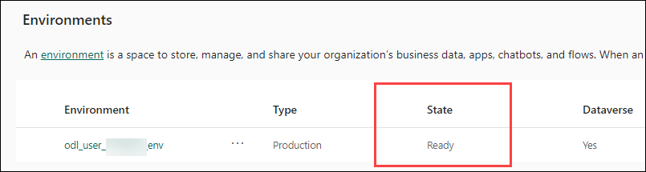

    **Note**: You can also use the **Refresh** button to check if the **State** is **Ready** after some time.

   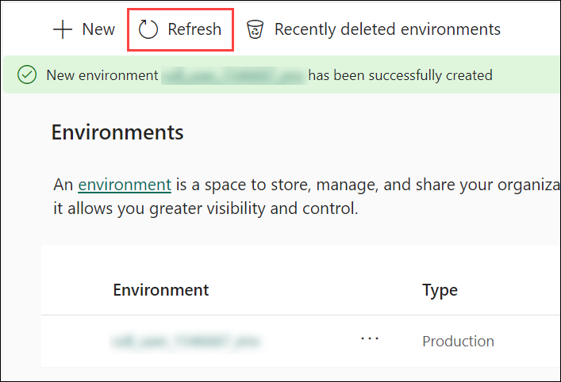

1. As you have now created a new environment, navigate to **Copilot Studio**  in a new tab using this link: [copilot studio](https://go.microsoft.com/fwlink/p/?linkid=2252408&clcid=0x409&culture=en-us&country=us)

1. On Welcome to Microsoft Copilot Studio page, Click on **Get Started**.

   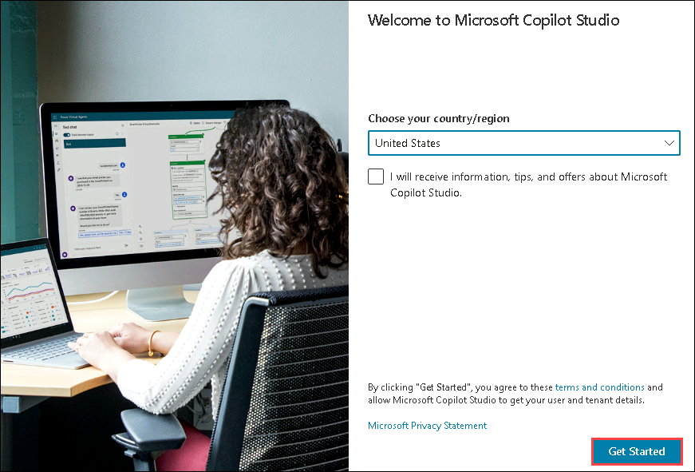

1. Once you navigate, you will be able to see a sign in page, please use the provided details to login and click on **sign in**:

   - **Email/Username:** <inject key="AzureAdUserEmail"></inject>

     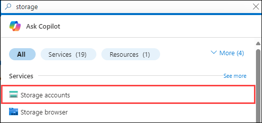

   - **Password:** <inject key="AzureAdUserPassword"></inject>

     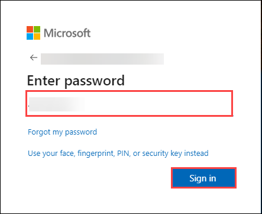

     >**Note** : If the **Welcome to Copilot Studio** prompt appears, click **Skip**.
 
1. Once you are inside **Copilot Studio** you will be in the home page. 

   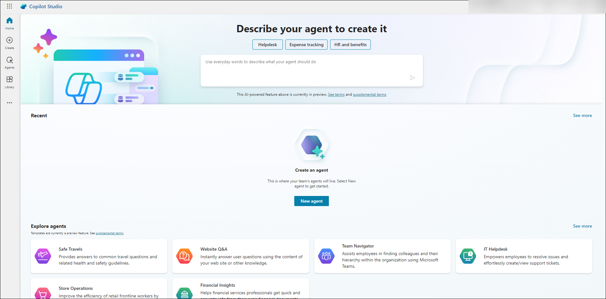

1. In the home page, select the environment option as shown.

   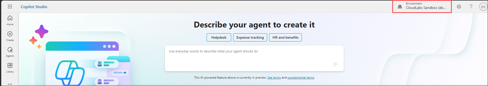

1. Change the environmnet to the new environmnet that you have created earlier. Keep the tab open as you will be using this in further exercises.

   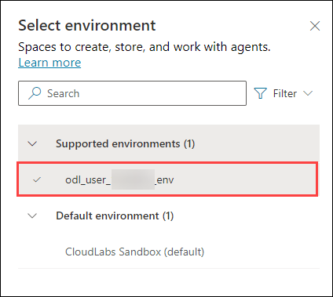

<validation step="658eee55-d10b-4753-b81b-52babd12f376" />

> **Congratulations** on completing the task! Now, it's time to validate it. Here are the steps:
> - Hit the Validate button for the corresponding task. If you receive a success message, you can proceed to the next task. 
> - If not, carefully read the error message and retry the step, following the instructions in the lab guide.
> - If you need any assistance, please contact us at cloudlabs-support@spektrasystems.com. We are available 24/7 to help

## Summary

In this exercise, you explored the fundamentals of Retrieval-Augmented Generation (RAG) and its role in enhancing AI workflows. You reviewed how RAG integrates external knowledge sources to deliver accurate and context-rich responses. Additionally, you gained an overview of Copilot Studio, learning how it automates RAG workflows and simplifies tasks such as data integration and skill customization. By logging into Copilot Studio, you became familiar with its interface, preparing you to leverage its capabilities for building effective RAG solutions.

### You have successfully completed this Exercise!
