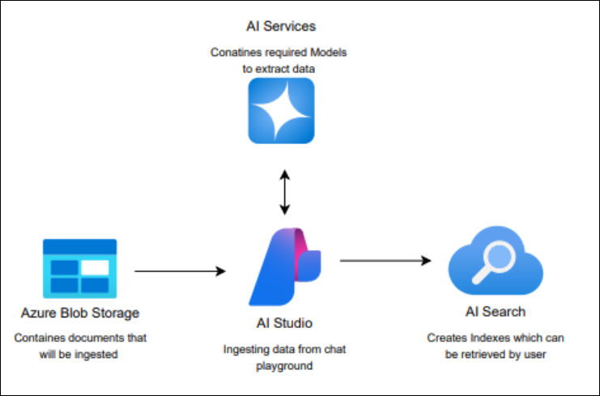
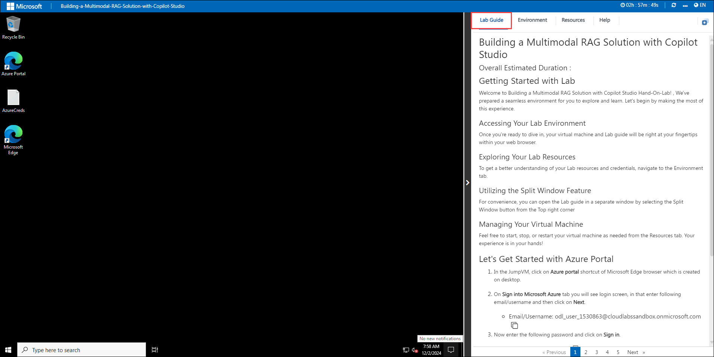
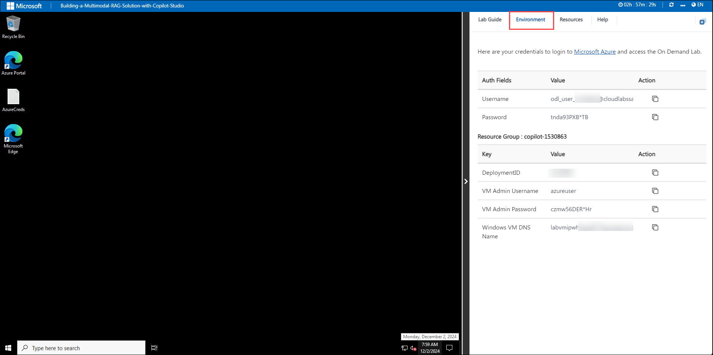
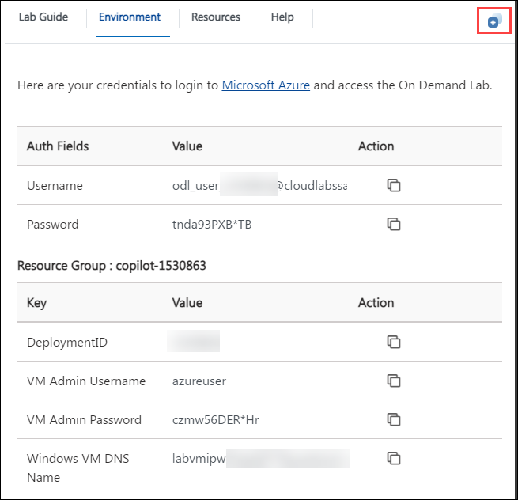
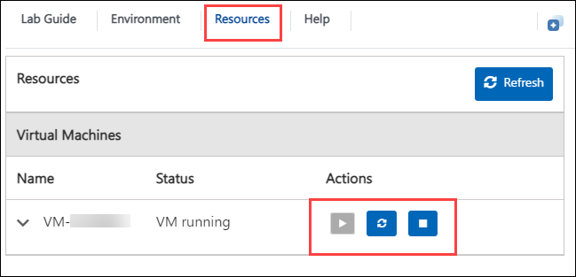
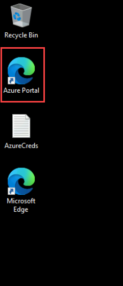
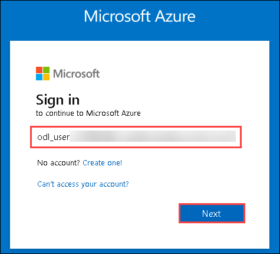
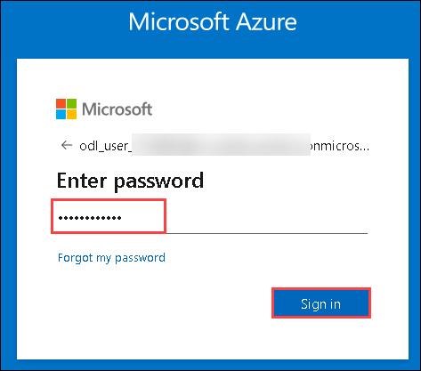

# Developing a Multimodal RAG Solution

### Overall Estimated Duration : 60 minutes

## Overview

This hands-on lab guides you through building and automating a Retrieval-Augmented Generation (RAG) solution. You will explore how to ingest diverse data sources while leveraging AI models like text embeddings, language models, and generative AI capabilities.

## Objective

Learn to build and automate a Retrieval-Augmented Generation (RAG) solution, leveraging AI models like text embeddings, language models, and generative AI. By the end of this lab, you will get insights on these concepts:

- **Build Retrieval Augmented Generation solution in Azure AI Foundry:** Learn to ingest data into a system powered by Azure AI tools and preprocess it using GPT-4 Turbo and text embedding models.

## Pre-requisites

Participants should have the following prerequisites:

- **Familiarity with Azure Resources:** Basic understanding of Azure services and the Azure portal for managing cloud resources.

- **Understanding of RAG Concepts:** Basic knowledge of Retrieval-Augmented Generation (RAG) and its applications in AI workflows.

## Architecture

The architecture facilitates the seamless ingestion and retrieval of data for user interactions. Documents are stored in Azure Blob Storage, which serves as the source for data ingestion. AI Studio processes these documents using models from Azure AI Services via the chat playground. The processed data is indexed using AI Search, allowing efficient retrieval.

## Architecture Diagram

## Explanation of Components

The architecture for this lab involves several key components:

- **Azure Blob Storage:** Serves as the primary data repository, storing documents that will be ingested into the system. This ensures secure and scalable storage for unprocessed data.

- **AI Studio:** Acts as the ingestion layer where documents from Azure Blob Storage are processed. It leverages Azure AI Services to apply language models for extracting relevant information and preparing it for indexing.

- **Azure AI Services:** Provides the advanced AI models, including language understanding and generative capabilities, used by AI Studio to extract data and process user interactions efficiently.

- **Azure AI Search:** Creates semantic indexes from the processed data, enabling efficient and meaningful retrieval of information. This component supports enhanced search capabilities by understanding user queries contextually.

## Getting Started with Lab

Welcome to Developing a Multimodal RAG Solution Hands-On-Lab! , We've prepared a seamless environment for you to explore and learn. Let's begin by making the most of this experience.

>**Note:** If a PowerShell window appears once the environment is active, please don't close it. Minimize it instead of closing it and proceed with the tasks.

### Accessing Your Lab Environment

Once you're ready to dive in, your virtual machine and Lab guide will be right at your fingertips within your web browser.

### Exploring Your Lab Resources

To get a better understanding of your Lab resources and credentials, navigate to the Environment tab.

### Utilizing the Split Window Feature

For convenience, you can open the Lab guide in a separate window by selecting the Split Window button from the Top right corner

### Managing Your Virtual Machine

Feel free to start, stop, or restart your virtual machine as needed from the Resources tab. Your experience is in your hands!

## Let's Get Started with Azure Portal

1. In the JumpVM, click on **Azure portal** shortcut of Microsoft Edge browser which is created on desktop.

   

1. On the **Sign into Microsoft Azure** tab, you will see the login screen. Enter the provided email or username, and click **Next** to proceed.

   - Email/Username: <inject key="AzureAdUserEmail"></inject>

     

1. Now, enter the following password and click on **Sign in**.

   - Password: <inject key="AzureAdUserPassword"></inject>

     

     >**Note:** If you see the Action Required dialog box, then select Ask Later option.
     
1. If you see the pop-up **Stay Signed in?**, click No.

1. If you see the pop-up **You have free Azure Advisor recommendations!**, close the window to continue the Lab.

1. If a **Welcome to Microsoft Azure** popup window appears, click **Cancel** to skip the tour.

## Support Contact

The CloudLabs support team is available 24/7, 365 days a year, via email and live chat to ensure seamless assistance at any time. We offer dedicated support channels tailored specifically for both learners and instructors, ensuring that all your needs are promptly and efficiently addressed.Learner Support Contacts:

- Email Support: cloudlabs-support@spektrasystems.com
- Live Chat Support: https://cloudlabs.ai/labs-support

Now, click on the **Next** from lower right corner to move on next page.

## Happy Learning!!
