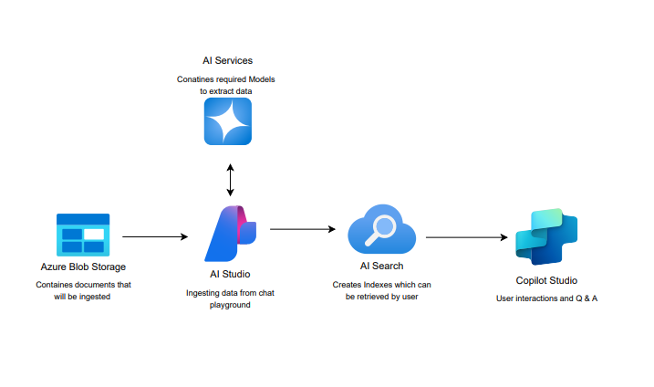

# Building a Multimodal RAG Solution with Copilot Studio

### Overall Estimated Duration : 4 Hours

## Overview

This hands-on lab guides participants through building and automating a Retrieval-Augmented Generation (RAG) solution using Copilot Studio. Participants will explore how to ingest diverse data sources while leveraging AI models like text embeddings, language models, and generative AI capabilities. The lab will cover customizing topics, automating workflows. Additionally, participants will learn to publish the solution to custom channels as websites. 

## Objective

Learn to build and automate a Retrieval-Augmented Generation (RAG) solution using Copilot Studio, leveraging AI models like text embeddings, language models, and generative AI. By the end of this lab, you will get insights on these concepts:

- **Introduction to Retrieval-Augmented Generation (RAG) Automation and Copilot Studio :** Understanding foundational concepts and practical applications of Retrieval-Augmented Generation (RAG).

- **Data Ingestion and Preprocessing :** Learn to ingest data into a system powered by Azure AI tools and preprocess it using GPT-4 Turbo and text embedding models.

- **Integrating AI Search with Copilot Studio :** Understand how to integrate AI Search with Copilot Studio to enhance your AI-powered workflows.

- **Deployment and Publishing Options :** Learn integrating Retrieval-Augmented Generation (RAG) with custom platforms, with an emphasis on deploying the solution to a public demo website.

## Pre-requisites

- **Familiarity with Azure Resources:** Basic understanding of Azure services and the Azure portal for managing cloud resources.

- **Knowledge of Copilot Studio:** Familiarity with Copilot Studio and its capabilities for building AI-driven solutions.

- **Understanding of RAG Concepts:** Basic knowledge of Retrieval-Augmented Generation (RAG) and its applications in AI workflows.

## Architecture

The architecture facilitates the seamless ingestion and retrieval of data for user interactions in Copilot Studio. Documents are stored in Azure Blob Storage, which serves as the source for data ingestion. AI Studio processes these documents using models from Azure AI Services via the chat playground. The processed data is indexed using AI Search, allowing efficient retrieval. Finally, Copilot Studio enables user interactions, including Q&A, by leveraging the indexed data for intuitive and responsive workflows.

## Architecture Diagram

## Explanation of Components

- **Azure Blob Storage:** Serves as the primary data repository, storing documents that will be ingested into the system. This ensures secure and scalable storage for unprocessed data.

- **AI Studio:** Acts as the ingestion layer where documents from Azure Blob Storage are processed. It leverages Azure AI Services to apply language models for extracting relevant information and preparing it for indexing.

- **Azure AI Services:** Provides the advanced AI models, including language understanding and generative capabilities, used by AI Studio to extract data and process user interactions efficiently.

- **Azure AI Search:** Creates semantic indexes from the processed data, enabling efficient and meaningful retrieval of information. This component supports enhanced search capabilities by understanding user queries contextually.

- **Copilot Studio:** Facilitates user interaction by connecting to Azure AI Search for Q&A and other workflows. It provides an intuitive interface for leveraging indexed data and AI capabilities in real-time.

## Getting Started with Lab

Welcome to Building a Multimodal RAG Solution with Copilot Studio Hand-On-Lab! , We've prepared a seamless environment for you to explore and learn. Let's begin by making the most of this experience.

### Accessing Your Lab Environment

Once you're ready to dive in, your virtual machine and Lab guide will be right at your fingertips within your web browser.

### Exploring Your Lab Resources

To get a better understanding of your Lab resources and credentials, navigate to the Environment tab.

### Utilizing the Split Window Feature

For convenience, you can open the Lab guide in a separate window by selecting the Split Window button from the Top right corner

### Managing Your Virtual Machine

Feel free to start, stop, or restart your virtual machine as needed from the Resources tab. Your experience is in your hands!

## Let's Get Started with Azure Portal

1. In the JumpVM, click on **Azure portal** shortcut of Microsoft Edge browser which is created on desktop.

1. On **Sign into Microsoft Azure** tab you will see login screen, in that enter following email/username and then click on **Next**.

   - Email/Username: <inject key="AzureAdUserEmail"></inject>

     

1. Now enter the following password and click on **Sign in**.

   - Password: <inject key="AzureAdUserPassword"></inject>

     

     >**Note:** If you see the Action Required dialog box, then select Ask Later option.
     
1. If you see the pop-up **Stay Signed in?**, click No.

1. If you see the pop-up **You have free Azure Advisor recommendations!**, close the window to continue the Lab.

1. If a **Welcome to Microsoft Azure** popup window appears, click **Cancel** to skip the tour.

1. Now, click on the **Next** from lower right corner to move on next page.

## Happy Learning!!