# Develop a Health Symptom and Disease Identification Copilot agent using Azure OpenAI and Copilot Studio - Solution Guide

## Task 1: Azure Blob Storage Deployment

1. On the Azure Portal, use the search bar to search for **Storage Accounts**, and select **Storage accounts**

   

1. In the **Storage accounts** pane, click on **+ Create** to create a storage acoount.

   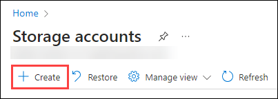

1. On **Create a storage account** page, provide the given values and click on **Review + create (5)** and click on Create.

   - Select the default **Subscription (1)**.

   - **Resource group**: Select **rag-hack-<inject key="Deployment ID" enableCopy="false"/> (2)**.

   - **Storage account name**: **storage<inject key="Deployment ID" enableCopy="false"/> (3)**.

   - **Redundancy**: Select **Locally-redundant-storage(LRS) (4)**.

     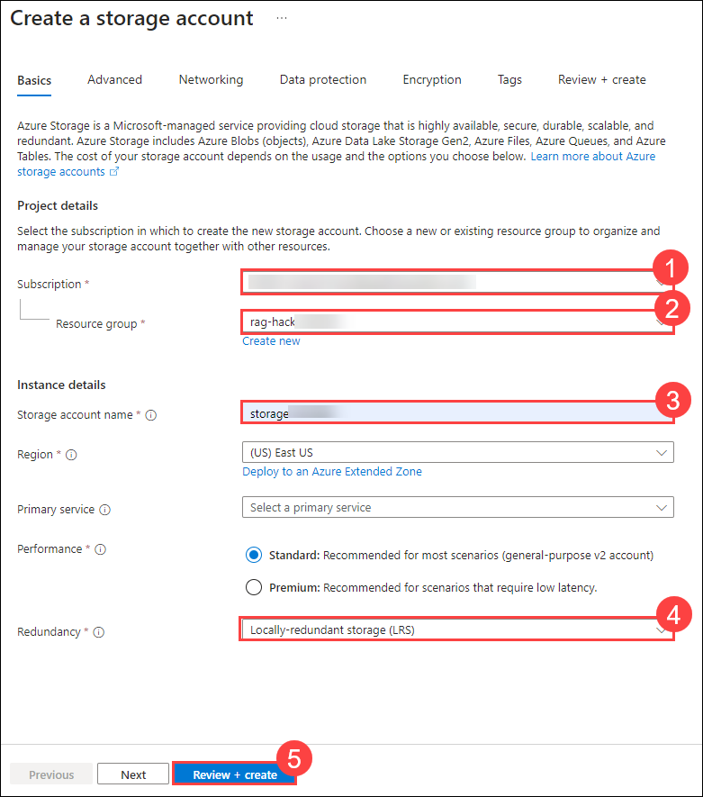

1. Now select the storage account that you have created earlier.

   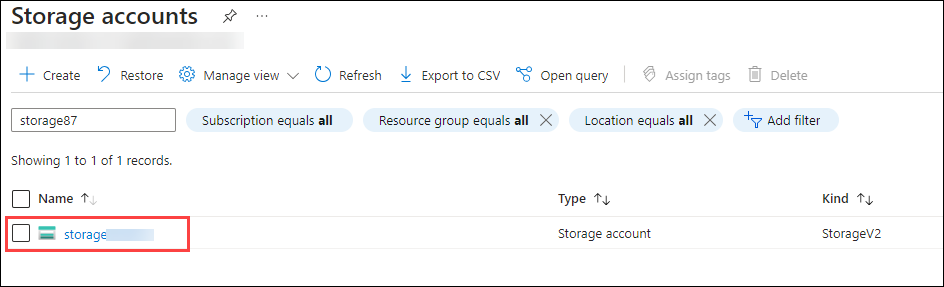

1. From the left menu, select **Containers** and click on **+ Container** to create a new container to store datasets.

   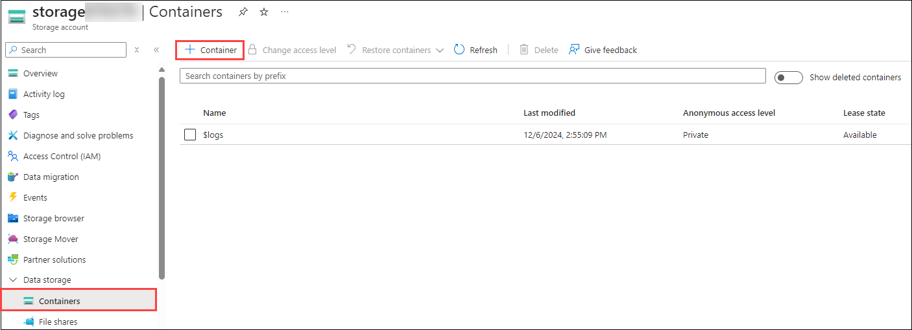

1. Provide name as **datasets** on **New container** window and click on **Create**.

   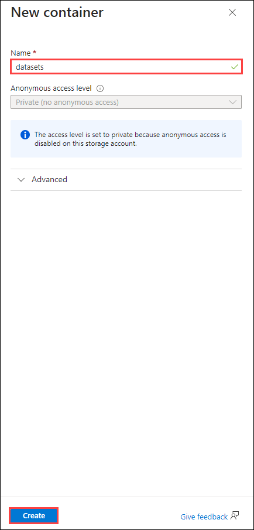

1. Now that you have created a container, upload the dataset files to the container. Click on **Upload** from the **Container** pane.

   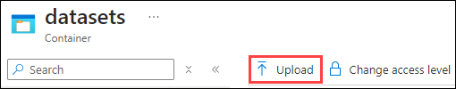

1. Please download and extract the [symptom_dataset]() file.

1. Now that you have extracted the files, browse and select those files and click on **Upload**.

   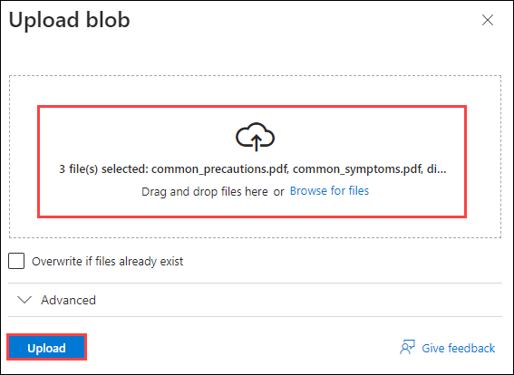

## Task 2: Azure AI Search Resource Deployment

1. Now search for **AI Search** using the search bar and select the **AI Search** service.

   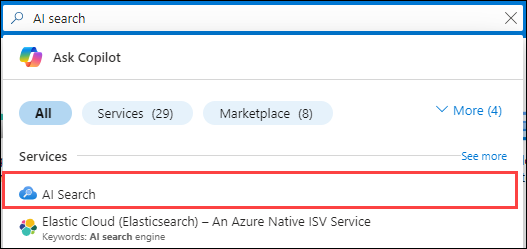

1. From the **Azure AI services | AI Search** page, click on **+ Create**.

   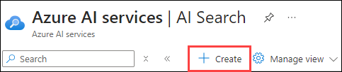

1. On the **Create a search service** pane, provide the following details and click on **Review + create (5)** and clik on create.

   - Select the default **Subscription (1)**.

   - **Resource Group**: Select **rag-hack-<inject key="Deployment ID" enableCopy="false"/> (2)**.

   - **Service name**: **aisearch-<inject key="Deployment ID" enableCopy="false"/> (3)**.

   - **Pricing tier**: Ensure that **Standard (4)** is selected.

     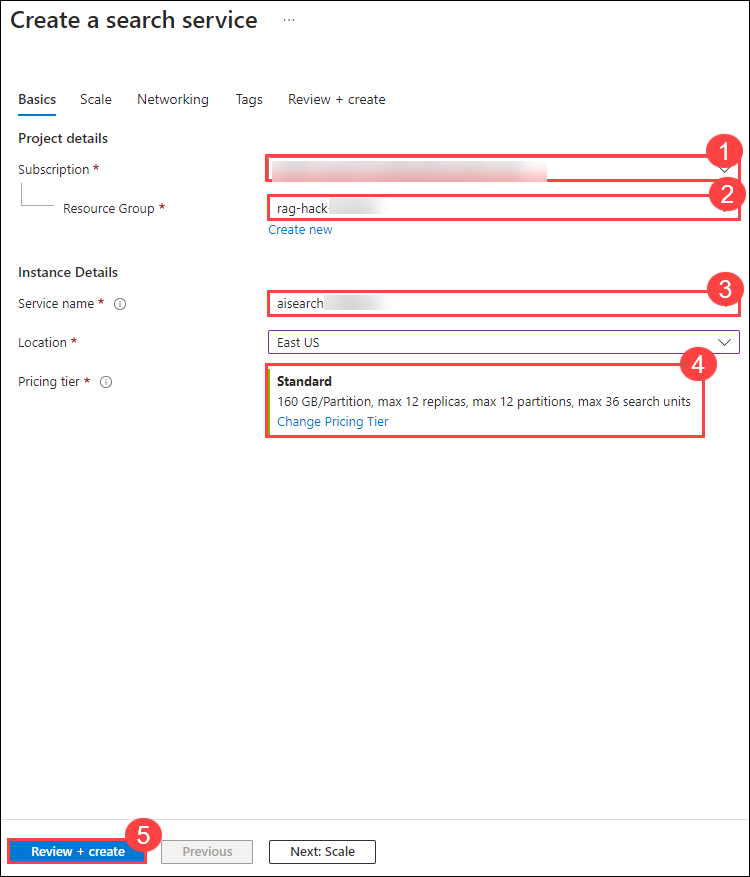

## Task 3: Azure OpenAI Service Deployment

1. Once after the AI Search service created, search for **Azure OpenAI** service and select it.

   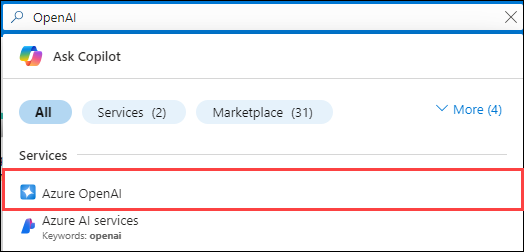

1. In the **Azure AI services | Azure OpenAI** pane, click on **+ Create**.

   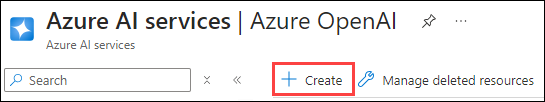

1. On **Create Azure OpenAI** page, provide the following details and click on **Next (5)**.

   - Select the default **Subscription (1)**.

   - **Resource Group**: Select **rag-hack-<inject key="Deployment ID" enableCopy="false"/> (2)**.

   - **Name**: **openai-<inject key="Deployment ID" enableCopy="false"/> (3)**.

   - **Pricing tier**: Select **Standard SO (4)**.

     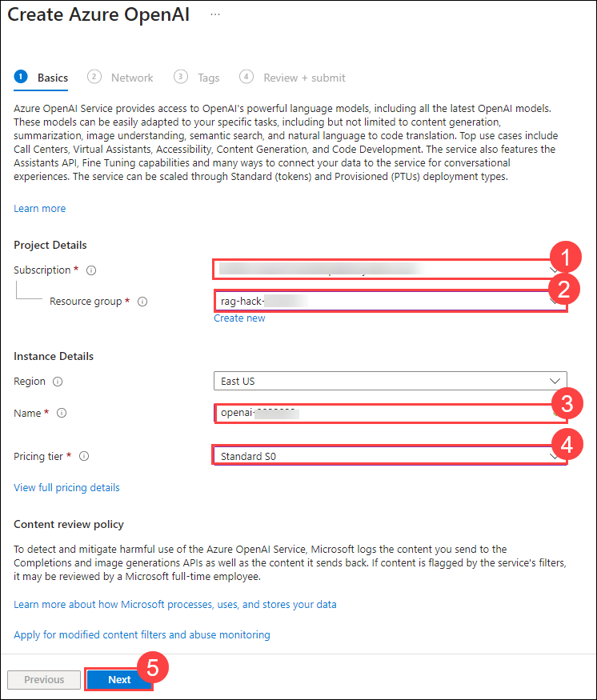

1. In the **Netwrok** tab, keep everything as default and click on **Next**.

   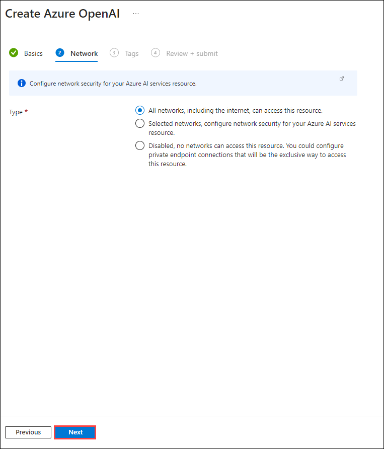

1. On the **Review + submit** pane, review and click on **Create**.
 
   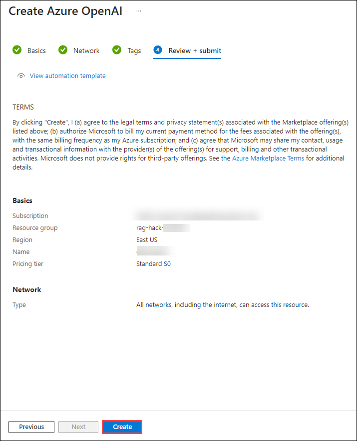

1. Once deployed, from the overview page, click on **Go to Azure AI Studio** to navigate to OpenAI Studio.

   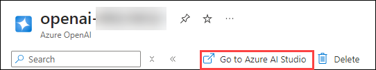

   >**Note:** If you are seeing the option as **Go to Azure AI Foundry portal**, then click on it and login with the credentials provided to you and continue the task.

1. Once you are inside the **Azure AI Foundry | Azure OpenAI Service** pane, select **Deployments (1)** from left menu, click on **+ Deploy model (2)** and select **Deploy base model (3)**.

   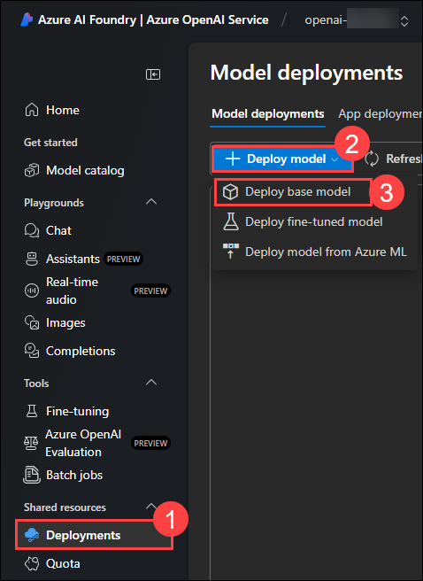

1. In the **Select a model** page, select **gpt-4** model and click on **Confirm**.

   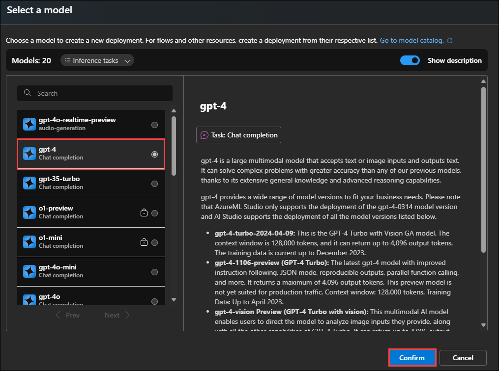

1. In the next pane, click on **Deploy** to deploy gpt-4 model.
   
   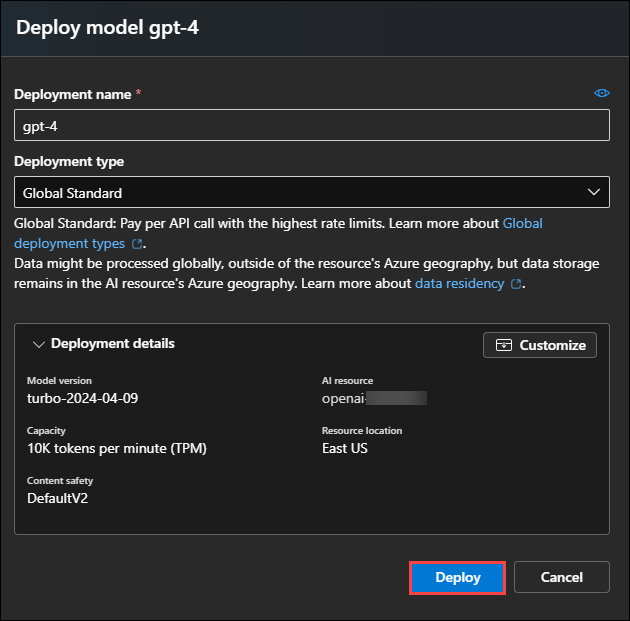

1. Again select **Deployments (1)** from left menu, click on **+ Deploy model (2)** and select **Deploy base model (3)**.

   

1. In the **Select a model** page, select **text-embedding-ada-002** model and click on **Confirm**.

   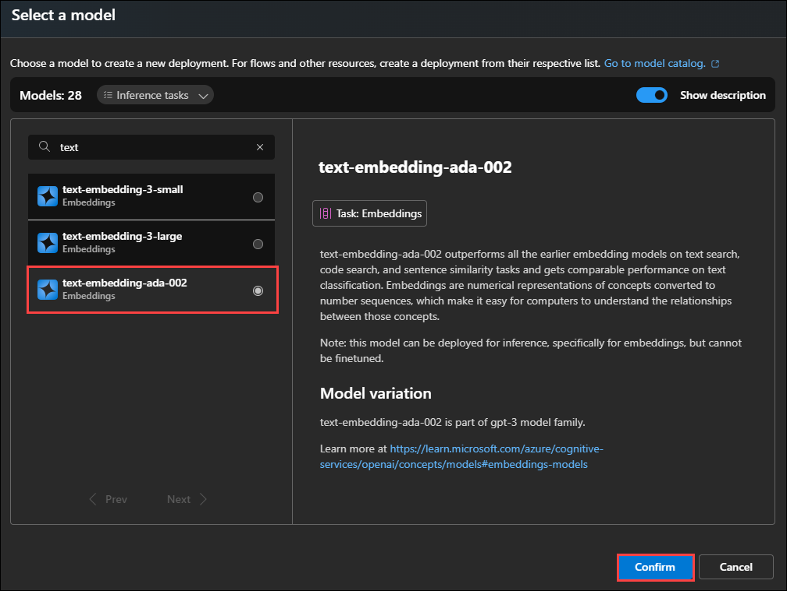

1. In the next pane, click on **Deploy** to deploy text-embedding-ada-002 model.

   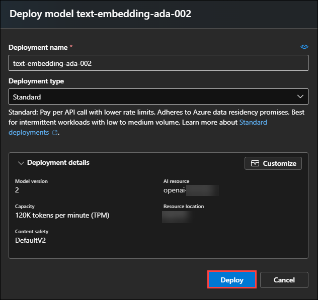

1. Verify that both the models are deployed successfully.

   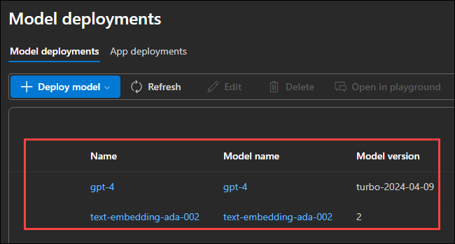

1. Now select **Chat (1)** from left menu, in **Chat playground** select **Add your data (2)** option and click on **+ Add a data source (3)** to ingest the datasets.

   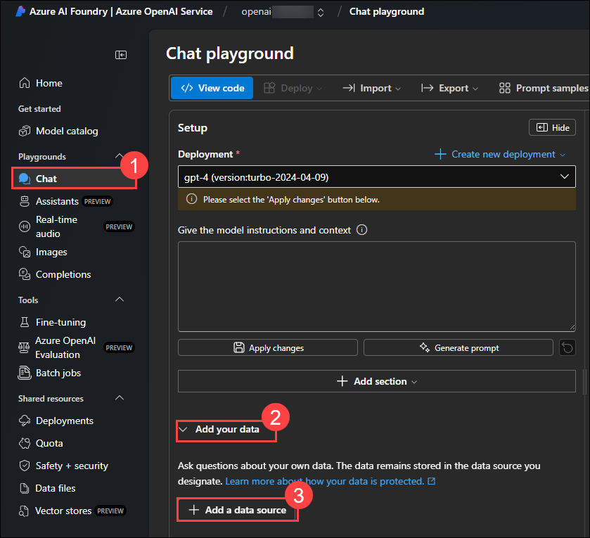

1. In the **Add data** page, provide the following details and click on **Next (9)**.  

   - **Select data source :** select **Azure Blob Storage (preview) (1)** from dropdown.

   - **Subscription :** Select default subscription **(2)**.

   - **Select Azure Blob Storage resource :** Select **storage<inject key="DeploymentID" enableCopy="false" />** **(3)** storage account from list.

   - **Select storage container :** select **datasets (4)** container.

   - **Select Azure AI Search resource :** select **aisearch-<inject key="DeploymentID" enableCopy="false" />** **(5)** AI Search.

   - **Enter the index name :** provide as **symptoms (6)**.

   - **Add vector search to this search resource :** ensure the option is **Checked (7)**

   - **Select an embedding model :** select **Azure OpenAI-text-embedding-ada-002 (8)** model.

     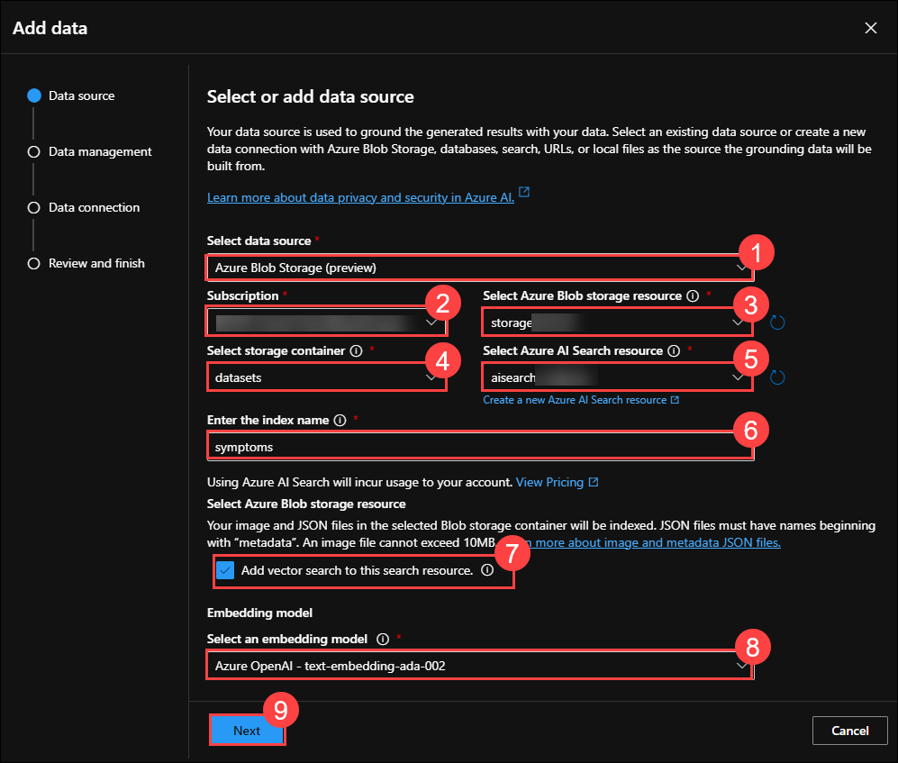

1. On the Data management pane, keep everything as default and click on **Next**.

1. In the **Data connection** page, check the **API Key (1)**, click on **Next (2)** and click on **save and close**.

   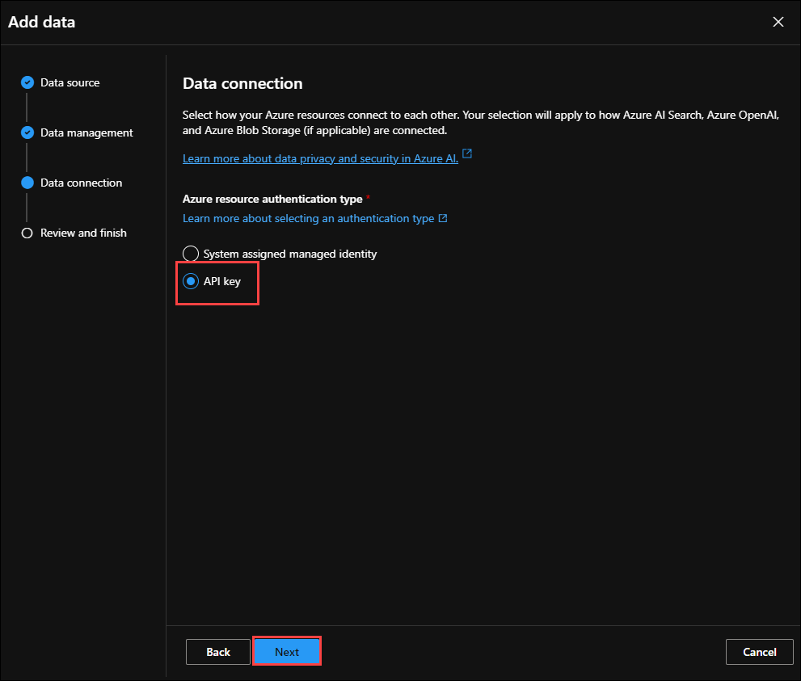

1. Once the Add data pane is closed, you can see **Ingestion in progress** status under Add you data. Please wait till it completes.

   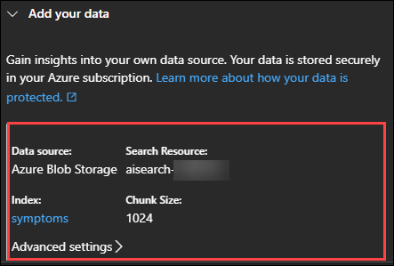

1. Once the ingestion is completed, navigate back to Azure portal and from the resource list of the resource group, select **aisearch-<inject key="DeploymentID" enableCopy="false" />** AI search.

1. In the **Azure AI Search** page, select **indexes** from left menu and you will be able to see an index with the name **symptoms** has been created.

   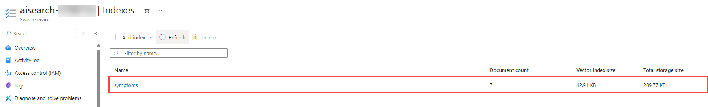

   >**Note:** Please wait till some data populates under **Vector index size**, it may take some time to populate. The data may differ from the value shown in screenshot.

1. Now the data is ingested and the index is created successfully.

1. From the overview page, copy the **URL** value and note it safely in a notepad, you will be using this further.

   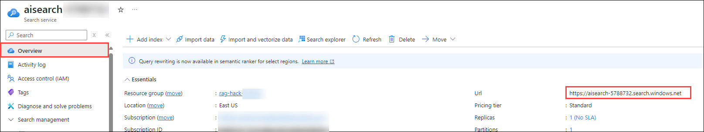

1. Select **Keys (1)** from left menu, copy **Primary admin key (2)** using the option as shown. You will be using this value further in this task.

   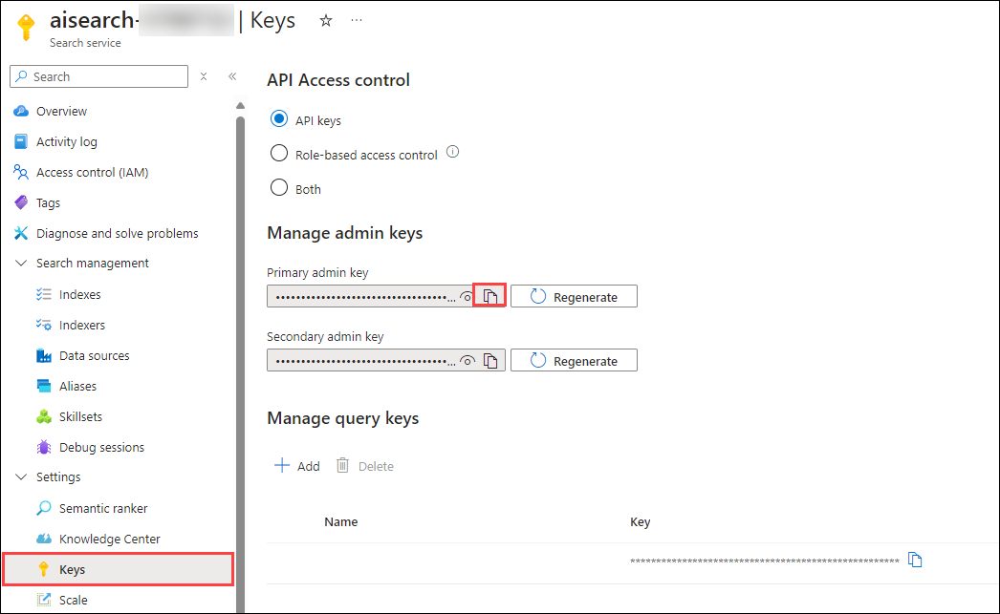

## Task 4: Copilot Studio Setup and Agent Creation

1. From your browser, navigate to **Copilot Studio** using this link [copilot studio](https://go.microsoft.com/fwlink/p/?linkid=2252408&clcid=0x409&culture=en-us&country=us)

1. Once you navigate, you will be able to see a sign in page, please use the provided details to login and click on **sign in**:

   - **Email/Username:** <inject key="AzureAdUserEmail"></inject>

     

   - **Password:** <inject key="AzureAdUserPassword"></inject>

     

1. Once you are inside **Copilot Studio** you will be in the home page.

   

1. In **Copilot Studio** tab, as you have already logged in, select **Create** from the left menu and click on **New agent** option to create a new AI agent.

   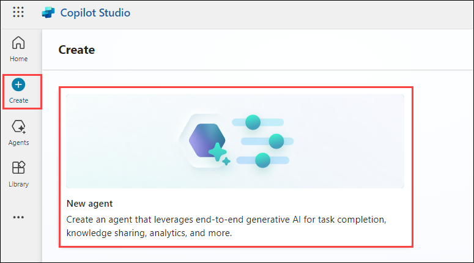

1. Inside the **Agent** pane click on **Skip to configure** as we will be configuring this further.

   

1. In the next pane, provide the **Name** as **Symptom Identification Agent** and click on create.

   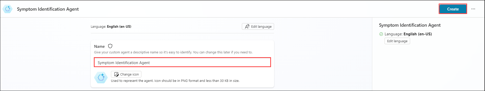

## Task 5: Topic Creation and Knowledge Base Integration

1. As you have created an agent, its time to add custom topics to it. In the **Agents** pane, under **Topics (1)** tab, select **+ Add a topic (2)** and click on **From blank (3)** from the dropdown as we are creating a custom topic.

   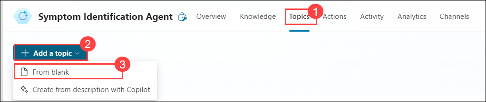

1. Now you will be navigated to design pane, where you can design the workflow of your topic. To build a workflow, click on **+** option.

1. Once after clicking on that, select **Advanced (1)** from the menu and click on **Genrative answers (2)**.

   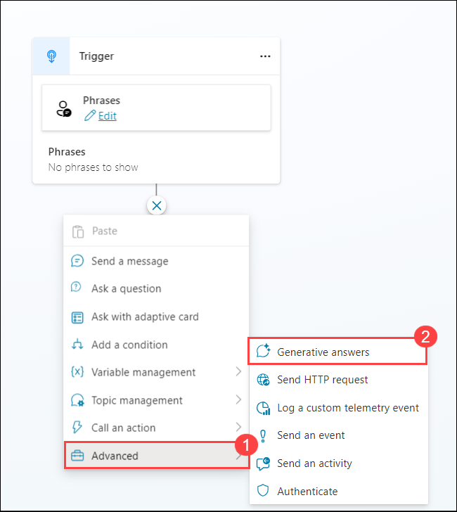

1. In the **Create genrative answers** node, select **>** option, this will open up a menu, from system tab select **Activity.Text**.

   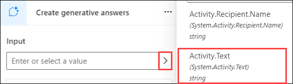

1. Now the **Create generative answers** component is created, click on **Edit** under **Data sources** to add your knowlegde base.

   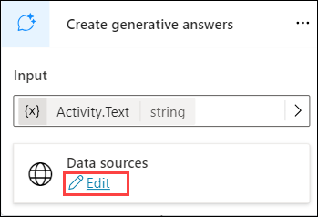

1. Now a new pane will be opend from the left, click on **+ Add knowledge** under Knowledge sources.

   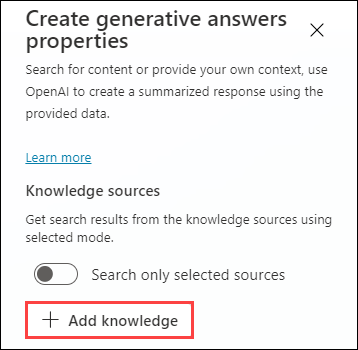

1. Now in the **Add knowledge** page, select **Advanced (1)** tab and click on **Azure AI Search (2)** as you are integrating Azure AI Search resource.

   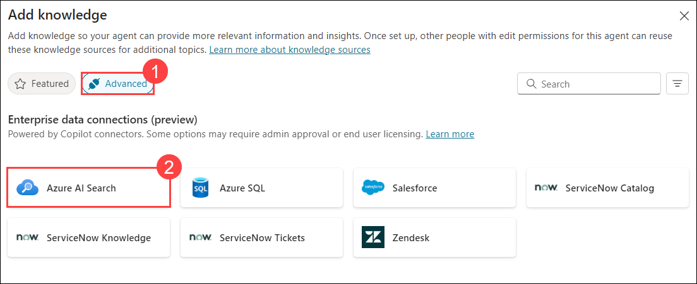

1. In the Azure AI Search page, select **Azure AI Search**.

1. Now provide **Azure AI Search Endpoint URL (1)** and **Azure AI Search Admin Key (2)** values which you have copied earlier and click on **Create (3)**.

   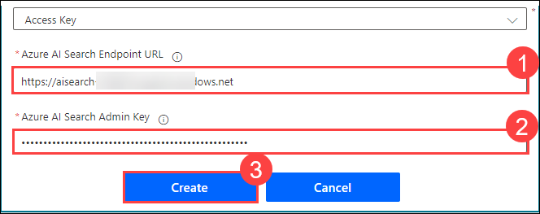

1. In the next pane, ensure that symptom index is selected and click on **Add**.

   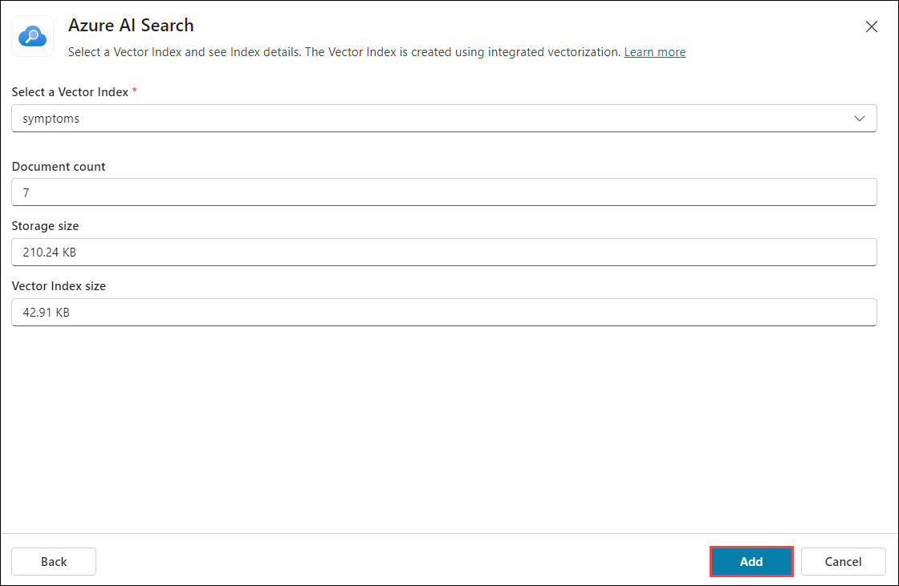

1. Once after adding the input, click on **Save** to save the topic.

   

1. In the design pane, you will be able to see a chat area in the right as **Test your agent**.

1. In the **Test your agent** pane, use the prompts given here and get the answers for them.

   - `I have a sore throat and fever, what diseases could this be?`

   - `How does the severity of conditions like depression and anxiety compare with physical diseases such as pneumonia and tuberculosis?`

     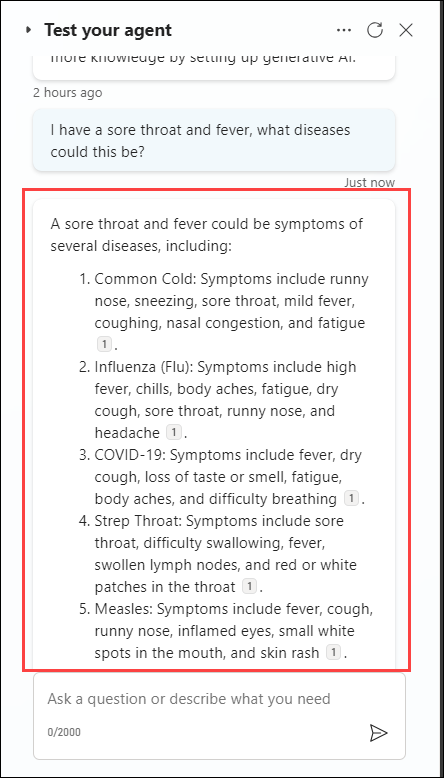

## Task 6: Publishing the Agent as Web App from Copilot Studio

 1. As you have configured and tested your bot, now its time to publish the agent as a demo website.

1. In the Copilot Studio agent page, from the top bar, select **Settings**. 

   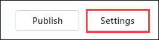

1. From the **Settings** pane, select **Security (1)** from left menu and check  **No Authentication (2)** option and click on **Save (3)**.

   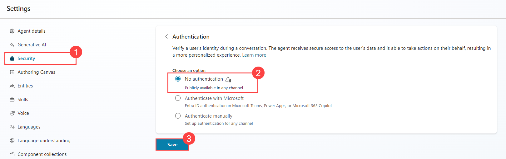

1. Once the authentication part is done, navigate to **Channels** tab and check that many options are available to publish the agent, but in this lab we will be using **Demo webiste** option, so click on that.

   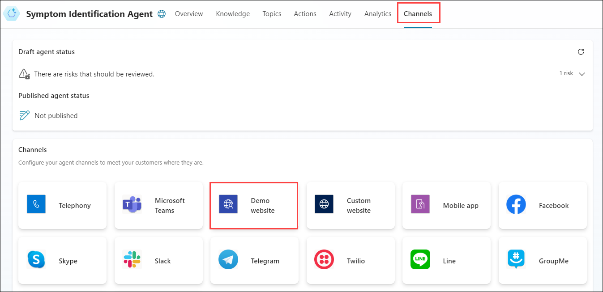

1. Once the **Demo Website** option is selected, a new pane will be opened from left. You can keep this default, click on **Copy** to copy the URL for the application and click on **Save**.

   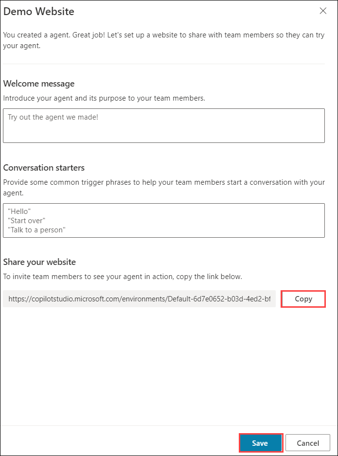

1. Once the configurations saved, close the tab and click on **Publish** from the top menu.

   

   > You can set up a welcome message and start over prompts aswell.

1. Once it is published, open a new tab in the browser and use the URL copied o navigate to the **Demo Website**. You will see a pleasant user interface with our agent will be opened, which copilot handled for us.

   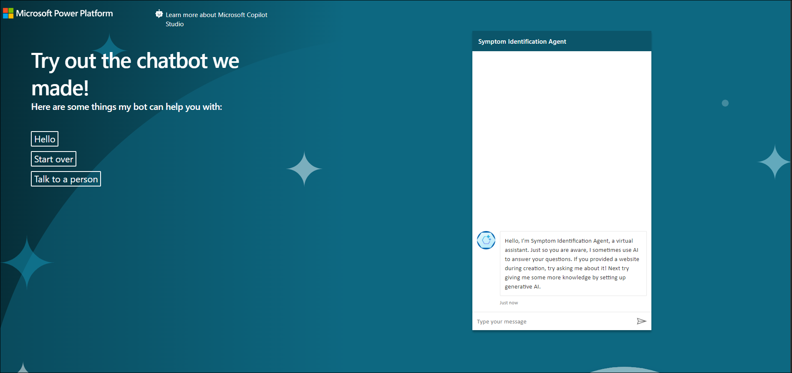

1. Now you have successfully hosted your Health Symptom and Disease Identification Copilot agent as a demo website.

1. Verify the agent by testing it with all the provided prompts to ensure it responds correctly and functions as expected:

   - `I have a rash and fever, could this be a viral infection?`

   - `Can you provide a summary of the symptoms and precautions for common respiratory diseases like the common cold, flu, and pneumonia?`

   - `I have a sore throat and fever, what diseases could this be?`

   - `I've been coughing and feeling short of breath, what conditions should I check?`

   - `Please list the diseases that require vaccination and give me a brief explanation of why they are important to prevent`

   - `I'm feeling chest pain and difficulty breathing, should I be worried about any particular disease?`

   - `Can you recommend simple precautions for managing chronic conditions like diabetes, hypertension, and asthma?`

   - `How does the severity of conditions like depression and anxiety compare with physical diseases such as pneumonia and tuberculosis?`

   - `I'm having digestive problems with bloating and irregular bowel movements, what conditions could this be?`

   - `I have a headache, nausea, and sensitivity to light, what could be causing this?`

## You have successfully completed the challenge!!

 